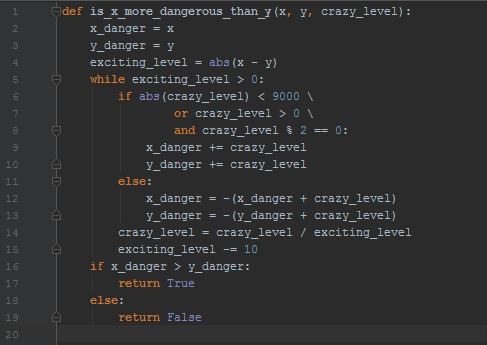

# Kiểm thử All-DU-Path

## Chương trình

## Đồ thị luồng

## All-DU-Path và ca kiểm thử tương ứng

| Variable       | DU-Path                | Test Case | x | y | crazy_level | Expected Output |
|----------------|------------------------|-----------|---|---|-------------|-----------------|
| x              | 1-2-4-20               | TC1       | 1 | 1 | 1           | False           |
| y              | 1-3-4-20               | TC1       | 1 | 1 | 1           | False           |
| crazy_level    | 1-5-20                 | TC1       | 1 | 1 | 1           | False           |
| crazy_level    | 1-5-6-9-5-20           | TC2       | 1 | 2 | 1           | False           |
| crazy_level    | 1-5-6-7-8-9-10-14-5-20 | TC3       | 1 | 2 | 9000        | False           |
| crazy_level    | 1-5-6-7-12-13-14-5-20  | TC4       | 1 | 2 | -9000       | True            |
| x_danger       | 2-5-16-20              | TC1       | 1 | 1 | 1           | False           |
| x_danger       | 2-5-9-5-16-20          | TC3       | 1 | 2 | 9000        | False           |
| x_danger       | 2-5-12-5-16-20         | TC4       | 1 | 2 | -9000       | True            |
| y_danger       | 3-5-16-20              | TC1       | 1 | 1 | 1           | False           |
| y_danger       | 3-5-10-5-16-20         | TC3       | 1 | 2 | 9000        | False           |
| y_danger       | 3-5-13-5-16-20         | TC4       | 1 | 2 | -9000       | True            |
| exciting_level | 4-5-20                 | TC1       | 1 | 1 | 1           | False           |
| exciting_level | 4-5-14-15-5-20         | TC2       | 1 | 2 | 1           | False           |

## Đo độ bao phủ

## Nhận xét

Kiểm thử theo MCDC và All-DU-Path đều có số ca kiểm thử như nhau, độ bao phủ như nhau trong trường hợp này.
Kiểm thử theo All-DU-Path có vẻ dễ thực hiện hơn do có đồ thị luồng.
